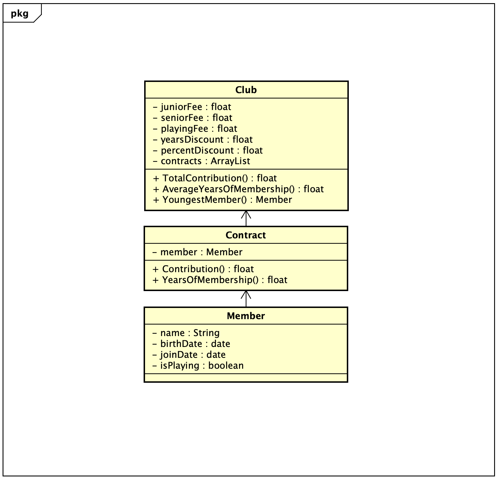

# Table Of Contents

- [Table Of Contents](#table-of-contents)
- [Startdocument for 8. Contribution](#startdocument-for-8-contribution)
  * [Problem Description](#problem-description)
    + [Input & Output](#input---output)
      - [Input](#input)
      - [Output](#output)
      - [Calculations](#calculations)
      - [Remarks](#remarks)
  * [Class Diagram](#class-diagram)
  * [Testplan](#testplan)
    + [Test Data](#test-data)
      - [Member](#member)
    + [Test Cases](#test-cases)
      - [#1 Get Individual Contribution](#-1-get-individual-contribution)
      - [#2 Get Total Contribution](#-2-get-total-contribution)
      - [#3 Get Average Number of Yeats of Membership](#-3-get-average-number-of-yeats-of-membership)
      - [#4 Get Youngest Member](#-4-get-youngest-member)

# Startdocument for 8. Contribution

Startdocument of **David Hlavacek**. Student number **5094879**.

## Problem Description

The following rules are operated to calculate the annual contribution to a
sports club: Senior members pay € 150,-, junior members pay € 75,-. Senior
members are people aged 18 or above. Playing members also pay a € 45,-
association contribution. People who have been members for more than 7
years are given a 5% discount on the club contribution.
A program must be developed in which the name, date of birth and date of
joining the club (format ddmmyyy) of each member can be entered, and also
whether the member is a playing or non-playing member. The contribution
of each member must be calculated and shown. The cumulative total contribution, the average number of years of membership and the youngest member
must also be shown. 

### Input & Output

In this section the in- and output of the application will be described.

#### Input

In the table below all the input are described.

|Case|Type|Conditions|
|----|----|----------|
|Name|`string`|not empty|
|Date of Birth|`Date`|dd/mm/yyyy|
|Date of joining The Club|`Date`|dd/mm/yyyy|
|Playing or Non-Playing|`Boolean`|`True` or `False`|

#### Output

|Case|Type|
|----|----|
|Individual Contribution|`Member` + `int`|
|Total Contribution|`int`|
|Average Years of Membership|`Float`|
|Youngest Member|`Member`|

#### Calculations

| Case              | Calculation                        |
| ----------------- | ---------------------------------- |
|Individual Contribution|Calculate the contribution for an individual member.|
|Total Contribution|Calculate the total contribution for each member.|
|Average Years of Membership|Calculate the average number of years of membership.|
|Youngest Member|Calculate the youngest member.|

#### Remarks

No remarks.

## Class Diagram

## Testplan

In this section the testcases will be described to test the application.

### Test Data

In the following table you'll find all the data that is needed for testing.

#### Member

| ID            | Input                             | 
| ------------- | --------------------------------- | 
| `member1`       | name: David H birthDate: 21/09/2001 joinDate: 07/06/2020 |
| `member2`       | name: Lara birthDate: 21/07/2001 joinDate: 07/07/2014  |
| `member3`       | name: Albert birthDate: 22/09/2006 joinDate: 07/06/2019 |
| `member4`       | name: Marcel birthDate: 21/09/2006 joinDate: 07/06/2014| 

### Test Cases

In this section the testcases will be described. Every test case should be executed with the test data as starting point.

#### #1 Get Individual Contribution

The contribution of each member must be calculated and shown.

|Expected output|
|---------------|
|David - |
|Lara - |
|Albert - |
|Marcel - |

#### #2 Get Total Contribution

Get the cumulative total contribution.

|Expected output|
|---------------|
||

#### #3 Get Average Number of Yeats of Membership

Get the average number of years of membership.

|Expected output|
|---------------|
|Lara|

#### #4 Get Youngest Member

Calculate the youngest member.

| Expected output |
| --------------- |
||

[scroll to top](#table-of-contents)
